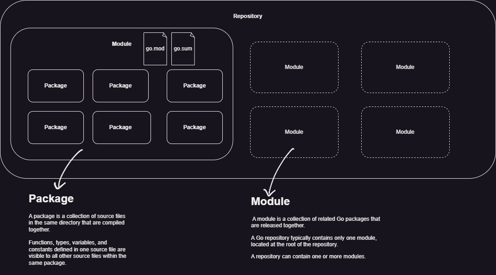

+++
title = 'Golang'
date = 2024-11-11T10:02:38Z
draft = false
description = 'Golang'
+++

# Created by Google engineers:
- Robert Griesemer
- Rob Pike
- Ken Thompson

# Features
- built-in concurrency support

# Go Commands

- `go mod`
- `go get -u PACKAGE`
- `go run`
- `go build`
- `go tidy`

# Categories



# Tools & Libraries

## Linting
- [golangci-lint](https://golangci-lint.run)
    - alternative to default linter

# Additional Links

1. [Read user input in Go (Golang) [cheatsheet]](https://gosamples.dev/read-user-input/)

# References:

1. [How to Write Go Code](https://go.dev/doc/code)
